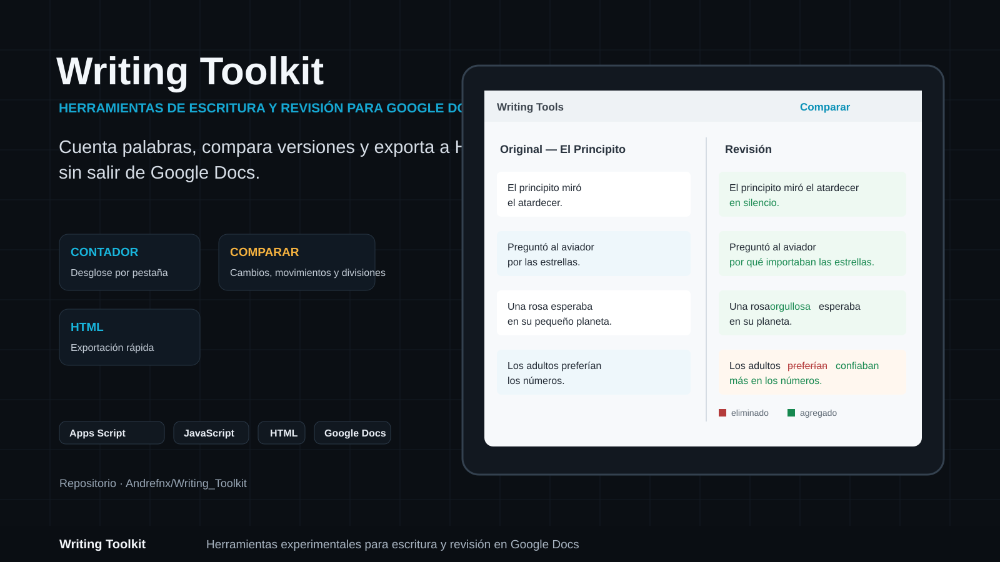
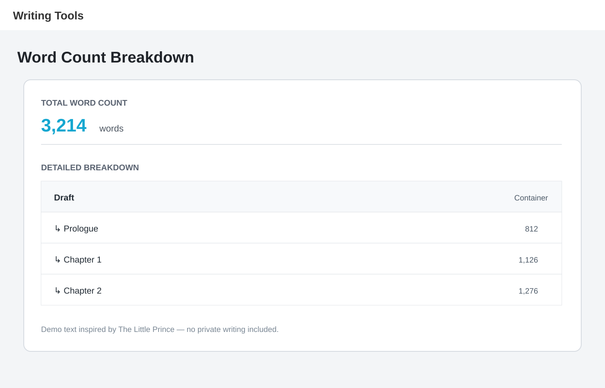
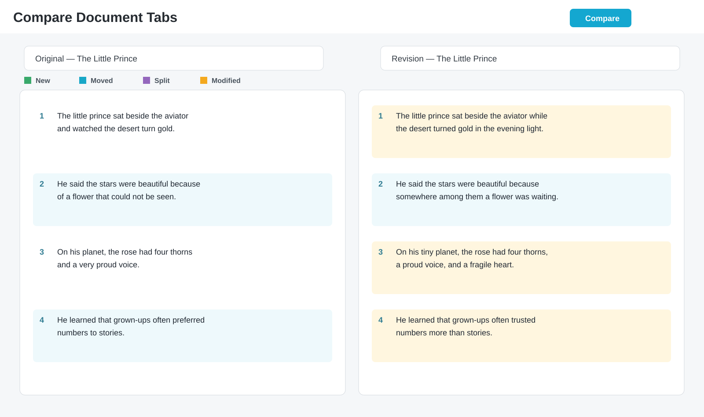

# Writing Toolkit




**Writing Toolkit** es una colección de herramientas para escribir, revisar y organizar documentos extensos dentro de Google Docs. Añade un menú propio mediante Google Apps Script para contar palabras con reglas personalizadas, comparar versiones guardadas en pestañas y exportar contenido a HTML.

> [!IMPORTANT]
> El proyecto sigue en desarrollo y funciona como complemento de Google Docs. No sustituye una revisión editorial, ortográfica o humana.

## Funciones principales

| Herramienta | Para qué sirve |
| --- | --- |
| **Count Words** | Calcula el total de palabras del documento y muestra un desglose por pestaña. |
| **Compare Document Tabs** | Compara dos pestañas por párrafos y detecta contenido nuevo, eliminado, modificado, movido o dividido. |
| **Export to HTML** | Convierte la pestaña activa a HTML para copiarla y reutilizarla fuera de Google Docs. |

## Vista previa

Las imágenes de demostración utilizan contenido ficticio inspirado en *El Principito*. No contienen borradores privados ni textos personales.

### Conteo de palabras



El contador muestra el total del documento y la distribución de palabras entre sus pestañas, útil para revisar rápidamente la extensión de capítulos o secciones.

### Comparación de versiones



La comparación enfrenta una versión original y una revisión. La interfaz permite identificar visualmente contenido agregado, eliminado, modificado, movido o dividido entre párrafos.

## Instalación

Writing Toolkit funciona como un proyecto de Apps Script vinculado a un documento de Google Docs. Para probarlo, utiliza primero un documento de prueba.

### Opción 1: instalación manual

1. Abre el documento de Google Docs donde quieras utilizar el toolkit.
2. Ve a **Extensiones → Apps Script**.
3. Copia los archivos del repositorio al proyecto manteniendo estos nombres:
   - `Código.gs` ← contenido de `Código.js`
   - `WordCounter.gs` ← contenido de `WordCounter.js`
   - `TabComparaison.gs` ← contenido de `TabComparaison.js`
   - `HtmlExport.gs` ← contenido de `HtmlExport.js`
   - `WcCounter.html`
   - `DiffTracker.html`
   - `Sidebar.html`
4. Guarda el proyecto.
5. Regresa al documento y vuelve a cargar la página.
6. Aparecerá el menú **Writing Tools** en la barra superior.
7. Ejecuta una herramienta y concede los permisos solicitados por Google la primera vez.

### Opción 2: instalación con clasp

Requiere Node.js 20 o superior, Git y la herramienta oficial `clasp`.

```powershell
git clone https://github.com/Andrefnx/Writing_Toolkit.git
cd Writing_Toolkit
npm install -g @google/clasp
clasp login
```

Después crea o abre un documento de prueba, entra en **Extensiones → Apps Script**, copia el **ID de secuencia de comandos** y crea un archivo local `.clasp.json`:

```json
{
  "scriptId": "PEGA_AQUI_TU_ID",
  "rootDir": ""
}
```

Envía los archivos con:

```powershell
clasp push
```

> [!WARNING]
> `clasp push` reemplaza los archivos del proyecto de Apps Script conectado. Utiliza primero un documento de prueba o un proyecto vacío.

## Cómo usarlo

### Contar palabras

1. Abre **Writing Tools → Count Words**.
2. Espera a que termine el análisis.
3. Revisa el total y el desglose de cada pestaña.

Reglas actuales:

- omite completamente las pestañas llamadas `Scenes`, `CUT` y `Originals`;
- en una pestaña llamada `Draft`, cuenta sus pestañas hijas, no el contenido del contenedor;
- excluye títulos, subtítulos y encabezados;
- incluye encabezados de página, pies de página y notas al pie;
- separa palabras por espacios, guiones y rayas.

Estas reglas todavía están definidas directamente en `WordCounter.js`.

### Comparar pestañas

1. Guarda la versión original y la revisada en dos pestañas del mismo documento.
2. Abre **Writing Tools → Compare Document Tabs**.
3. Selecciona la pestaña de origen a la izquierda.
4. Selecciona la versión revisada a la derecha.
5. Pulsa **Compare**.

La vista utiliza colores y relaciones de párrafos para mostrar texto eliminado, texto nuevo, párrafos movidos o divididos, modificaciones, reescrituras y párrafos que permanecen iguales. La comparación es heurística y los resultados deben revisarse antes de tomar decisiones editoriales.

### Exportar a HTML

1. Activa la pestaña que quieres exportar.
2. Abre **Writing Tools → Export to HTML**.
3. Revisa el HTML generado en la barra lateral.
4. Pulsa **Copy HTML**.

Actualmente conserva encabezados, alineación, negrita, cursiva, subrayado, tachado, enlaces y tablas básicas. También permite transformar texto pegado manualmente en párrafos HTML.

## Estructura del proyecto

```text
Writing_Toolkit/
├── Código.js
├── WordCounter.js
├── WcCounter.html
├── TabComparaison.js
├── DiffTracker.html
├── HtmlExport.js
├── Sidebar.html
├── appsscript.json
└── docs/
    ├── DEVELOPMENT.md
    └── assets/
        ├── writing-toolkit-cover.svg
        ├── word-count-demo.svg
        └── compare-demo.svg
```

Los archivos ejecutables se mantienen en la raíz para facilitar la sincronización con Apps Script. La documentación y los recursos visuales se almacenan en `docs/`.

## Estado actual

- Proyecto en desarrollo activo.
- La interfaz está principalmente en inglés.
- Las reglas del contador todavía no se configuran desde la interfaz.
- La comparación puede producir coincidencias imperfectas cuando el texto fue reescrito de forma extensa.
- La exportación HTML no reproduce todo el formato disponible en Google Docs.
- Todavía no existe publicación automática como complemento de Google Workspace.

## Desarrollo

Consulta [`docs/DEVELOPMENT.md`](docs/DEVELOPMENT.md) para conocer la función de cada archivo y el flujo recomendado con `clasp` y Git.

## Autor

Desarrollado por [Andrea Henríquez](https://github.com/Andrefnx) como herramienta complementaria para escritura y revisión en Google Docs.
